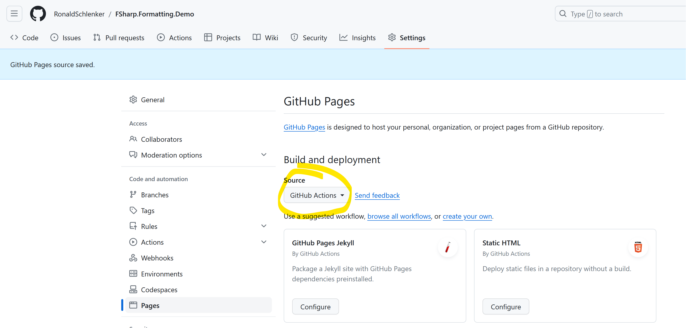

# FSharp.Formatting.Demo

A repo for demonstrating a minimal FSharp.Formatting use case with GH pages

## Some Infos

* **Enable GizHub Pages** like so:

* **Change parameters** in `./build/docs.ps1`

* The **docs content** is located in `./src/docs`

* The docs are created and publishes using the `.github/workflows/build-and-publish-docs.yml` workflow. It triggers manually or on push to "main".

* You can **edit the docs during development** by running `./build/docs.ps1 watch` from the repo root.
    * Don't forget to forward the port if you are in a codespace.
